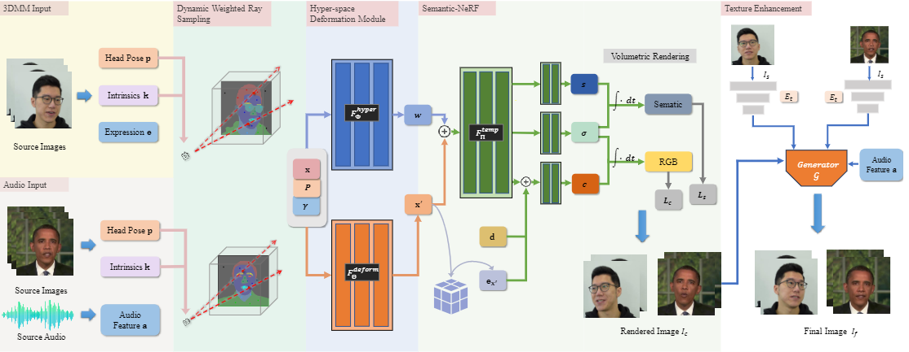

# Semantic-Aware Hyper-Space Deformable Neural Radiance Fields for Facial Avatar Reconstruction

This repository provides the official PyTorch implementation for the following paper:

**Semantic-Aware Hyper-Space Deformable Neural Radiance Fields for Facial Avatar Reconstruction**



## Abstract

> Facial avatar reconstruction from a monocular video is a fundamental task for many computer vision applications. We present a novel framework based on semantic-aware hyper-space deformable NeRF that can reconstruct high-fidelity face avatars from either 3DMM coefficients or audio features. Our proposed framework can deal with both local facial movement and global movement of the head and torso by using semantic guidance and a unified hyper-space deformation module. Specifically, we adopt a dynamic weighted ray sampling strategy for paying different attention to different parts of semantic regions and enhance the deformable NeRF by incorporating semantic guidance for capturing the fine-grained details of various facial parts. Furthermore, we introduce a hyper-space deformation module that transforms the observation space coordinates to the canonical hyper-space coordinates for learning natural facial deformation and head-torso movements. We conduct extensive experiments to demonstrate the effectiveness of our framework and show that our method outperforms the existing state-of-the-art methods. 

## Setup

**Clone this code:**

```
git clone git@github.com:jematy/SAHS-Deformable-Nerf.git
cd SAHS-Deformable-Nerf
```

**Dependencies:**

```
conda create --name Nerf python=3.8
conda activate Nerf
pip install -r requirements.txt
```

### Dataset Preparation

Our model was trained on the  [Nerface](https://github.com/gafniguy/4D-Facial-Avatars) and [AD-NeRF](https://github.com/YudongGuo/AD-NeRF) dataset. 

### Pre-Trained Models

[Click here](https://drive.google.com/drive/folders/18qItNYgUXUUVrqsG6XY20O6GmZwLktGq?usp=sharing) to download the pre-trained models. Put these downloaded files into the project directory. 

## Inference


### Eval StageI

```
python nerf-pytorch/eval_stage_rays.py --config nerf-pytorch/config/audio/person_2_auto.yml --checkpoint ./audio_person_2/checkpoint499999.ckpt --savedir ./renders/first_stage
```

### Eval StageII

```
python nerf-pytorch/eval_get_texture_photo_audio.py --config nerf-pytorch/config/audio/person_2_auto.yml --checkpoint ./audio_person_2/checkpoint_150000.ckpt --savedir ./renders/second_stage
```

The final results will be saved to the directory`renders/second_stage`

## Acknowledgments

Part of the code is borrowed from [Nerface](https://github.com/gafniguy/4D-Facial-Avatars) and [AD-NeRF](https://github.com/YudongGuo/AD-NeRF).
